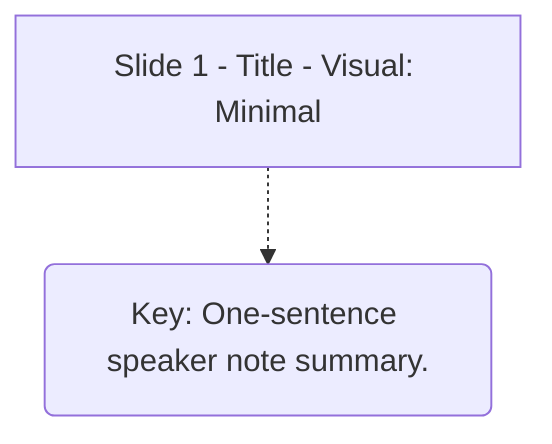

Creates FigJam flowcharts for presentation structures using the Figma MCP `generate_diagram` tool.

**Critical constraint:** Every call creates a **new** FigJam file. There is no way to update or edit an existing diagram.

## Setup

Load the tool before first use:

```
ToolSearch(query="select:mcp__claude_ai_Figma__generate_diagram")
```

## Mermaid Rules (Tool Constraints)

| Rule | Detail |
|------|--------|
| No emojis | Strip all emoji from node labels |
| No `\n` | No newlines in labels — keep to one line per label |
| Quotes required | All node and edge labels must be in double quotes |
| Supported types | `flowchart`, `graph`, `sequenceDiagram`, `stateDiagram`, `gantt` |
| Direction | TD for linear slide flows; LR for process/step flows |

## Slide Node Pattern

Use rectangles for slides, rounded nodes for speaker notes, dotted connections:



- `["..."]` — slide node (rectangle)
- `("...")` — note node (rounded, visually distinct)
- `-.->` — dotted connection (slide to note)

## Subgraph Grouping

Group thematically related slides:

```mermaid
subgraph "Foundation Layer"
    C
    D
end
```

## Tool Parameters

```
name:         Short descriptive title
mermaidSyntax: <cleaned Mermaid source>
userIntent:   What you are trying to accomplish
```

## What the Tool Cannot Do

- Update or edit an existing FigJam diagram
- Position shapes at specific coordinates
- Add sticky notes or free-text annotations outside Mermaid
- Apply custom fonts, colors, or styles (beyond basic Mermaid)

## After Generation

1. Click the returned `claimFileUrl` to open and claim the FigJam
2. Drag companion note nodes beside their slide for a two-column layout
3. To convert to Figma Slides: duplicate frames manually into a new Slides file
