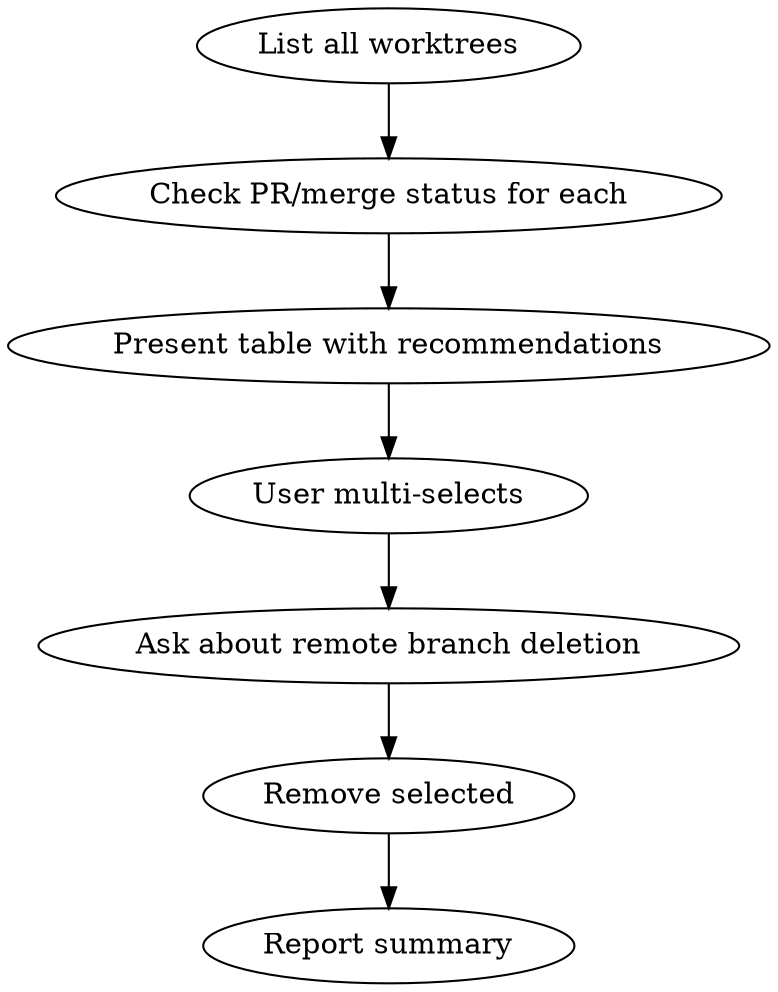

# Clean Up Stale Git Worktrees

## Overview

Scans all worktrees, checks each branch's PR and merge status, and lets you batch-remove stale ones.

## Workflow



## Steps

### 1. Gather State

```bash
git worktree list
git branch --show-current
```

Identify the current worktree — it will be protected from removal.

### 2. Check Each Worktree

For each worktree (excluding the main repo entry):

```bash
# Check PR status
gh pr view <branch> --json state,mergedAt 2>/dev/null

# Check if branch is merged into main locally
git branch --merged main | grep <branch>
```

Categorize each:

| Status | Meaning | Recommendation |
|--------|---------|----------------|
| `merged` | PR merged or branch merged into main | Safe to remove |
| `closed` | PR closed without merge | Likely safe to remove |
| `open` | PR still open | Keep |
| `no PR` | No PR exists, not merged | Keep (or ask) |

### 3. Present Results

Use `AskUserQuestion` with `multiSelect: true`.

Format each option as: `<branch> — <status> — <path>`

- Pre-recommend `merged` and `closed` for removal
- Mark current worktree as "(current — protected)" and do NOT include it as a selectable option
- If all worktrees are current or active, report "No stale worktrees found" and exit

### 4. Ask About Remote Branches

Before removing, ask once:

```
Also delete remote branches for the selected worktrees?
1. Yes, delete remote branches too
2. No, only remove local worktrees and branches
```

### 5. Remove Selected

For each selected worktree:

```bash
# Check for uncommitted changes first
git -C <worktree-path> status --porcelain
```

- If uncommitted changes: warn and ask to confirm or skip this one
- If clean:
  1. `git worktree remove <path>`
  2. `git branch -d <branch>` (safe delete — will fail if not merged, that's OK)
  3. If user chose remote deletion: `git push origin --delete <branch>`

### 6. Report Summary

```
Cleaned up N worktrees:
  - user.feat-auth (merged, removed)
  - user.fix-bug (closed, removed)

Kept:
  - user.ios-android-screengrabs (current)
  - user.new-feature (open PR)
```

## Edge Cases

- **Current worktree:** Never offered for removal
- **`gh` not available:** Fall back to `git branch --merged main` only; skip PR status check
- **Uncommitted changes:** Warn per-worktree, skip unless user confirms
- **Branch delete fails:** Log warning, continue with next — branch may not be merged locally even if PR is merged on remote
- **No stale worktrees:** Report clean state and exit early

## Common Mistakes

- **Removing current worktree** — always protect it
- **Not checking for uncommitted changes** — could lose work
- **Force-deleting branches** — use `-d` (safe) not `-D` (force) unless user confirms
- **Assuming `gh` is available** — always have a fallback path
