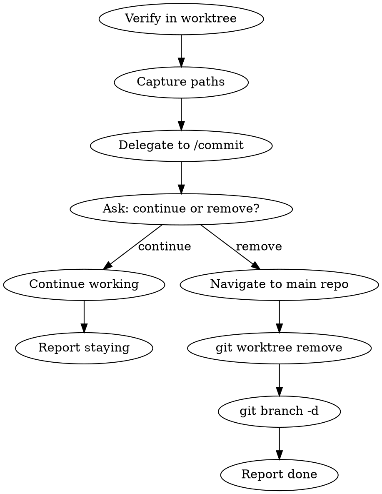

# Commit and Push from Worktree

## Overview

One-shot commit workflow for worktrees. Delegates git work to `/commit`, then offers to continue working or tear down the worktree.

## Workflow



## Steps

### 1. Verify Worktree Context

```bash
git worktree list
pwd
```

Compare current directory against worktree list. If not inside a worktree (i.e., in the main repo), warn:

```
You're not in a worktree — you're in the main repo.
Use /commit directly instead.
```

Exit the skill.

### 2. Capture Paths

Before any work, save:

```bash
# Current worktree path
WORKTREE_PATH=$(pwd)

# Main repo path (first entry in worktree list)
MAIN_REPO=$(git worktree list | head -1 | awk '{print $1}')

# Current branch
BRANCH=$(git branch --show-current)
```

### 3. Delegate to /commit

Invoke `/commit` for the full commit workflow:
- Detects changes
- Stages files
- Generates conventional commit message
- Pushes
- Creates or updates PR

Let the commit skill run its full flow. Do not interfere with its steps.

### 4. Ask: Continue or Remove?

After the commit flow completes (whether user pushed, created PR, or chose to continue):

```
What would you like to do with this worktree?
1. Continue working here
2. Remove this worktree (done with it)
```

### 5a. If Continue

Report:

```
Staying in <worktree-path> on branch <branch>.
Run /worktree-clean later to tidy up old worktrees.
```

Done.

### 5b. If Remove

**Check for uncommitted changes first:**

```bash
git status --porcelain
```

If uncommitted changes exist, warn:

```
This worktree has uncommitted changes:
  <list files>

Remove anyway? This will discard those changes.
1. Yes, remove anyway
2. No, keep working
```

**If clean or user confirmed:**

```bash
# Navigate out of the worktree first
cd <MAIN_REPO>

# Remove worktree
git worktree remove <WORKTREE_PATH>

# Safe-delete local branch (fails gracefully if not merged)
git branch -d <BRANCH> 2>/dev/null
```

Report:

```
Worktree removed. Back in <MAIN_REPO> on <main-branch>.
```

Note: `git branch -d` may fail if the branch isn't merged locally — that's expected when the PR is still open on remote. The branch will be cleaned up later by `/worktree-clean` after the PR merges.

## Edge Cases

- **Not in a worktree:** Exit early, suggest `/commit` instead
- **No changes to commit:** `/commit` will report no changes — still offer the teardown question (user may have pushed earlier)
- **User skips push in /commit:** Still offer teardown — they may be done regardless
- **Uncommitted changes at teardown:** Warn explicitly before removing
- **`git branch -d` fails:** Non-fatal, log and continue — branch lives on remote

## Common Mistakes

- **Removing worktree without navigating out first** — `git worktree remove` fails if you're inside the directory
- **Force-deleting branch** — use `-d` not `-D`; let `/worktree-clean` handle force cases later
- **Skipping uncommitted changes check** — could silently discard work
- **Reimplementing commit logic** — always delegate to `/commit`
