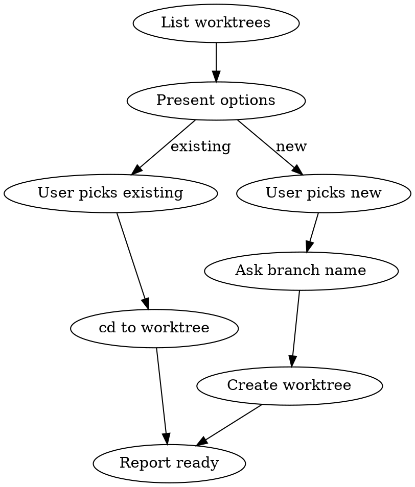

# Select or Create Git Worktree

## Overview

Lists existing worktrees and lets you pick one to work in, or create a new one from `main`. Designed to be used alongside worktree creation skills that handle safety verification.

## Workflow



## Steps

### 1. Gather State

```bash
git worktree list
git branch --show-current
```

### 2. Build Options

Present with `AskUserQuestion`:

| Option | Description |
|--------|-------------|
| Each existing worktree | `branch-name` at `path` (commit hash) |
| **Create new from main** | Always available, even on feature branches |

**Format each worktree option as:** `branch-name — path (abc1234)`

Mark the current worktree with "(current)" so the user knows where they are.

### 3. Handle Selection

**Existing worktree selected:**
- `cd` into the worktree path (this persists for subsequent Bash calls)
- Verify with `pwd && git branch --show-current`
- Report: "Now working in `<path>` on branch `<branch>`"

**New from main selected:**
- Ask for branch name (convention: `<username>.<name>`)
- Get username: `git config user.name | tr '[:upper:]' '[:lower:]' | tr ' ' '-'`
- **Pull latest main before creating:** `git fetch origin main && git checkout main && git pull origin main`, then create the worktree from the updated main
- Create the worktree: `git worktree add <worktree-path> -b <branch-name>`
- **After creation, `cd` into the new worktree path** so all subsequent commands run there
- Verify with `pwd && git branch --show-current`

### 4. Switch Working Directory (CRITICAL)

After selecting or creating a worktree, you **must** run:

```bash
cd <worktree-path>
```

This ensures all subsequent Bash tool calls operate in the worktree. Without this step, commands will continue to run in the original repo directory.

> **Note:** The Claude Code status bar may still show the original branch — this is a UI limitation. The actual working directory for Bash commands will be correct after `cd`.

## Example

```
Using worktree:select to pick a workspace.

Current worktrees:
1. user.feat-units-table — .worktrees/... (current)
2. user.mui-documentation — .worktrees/...
3. Create new worktree from main

Which workspace?
> 2

Now working in .worktrees/user.mui-documentation on branch user.mui-documentation.
```

## Common Mistakes

- **Forgetting to list the main repo** as a worktree option (it's always in `git worktree list`)
- **Not marking current** — user needs to know where they already are
- **Creating when one exists** — always check existing worktrees first
