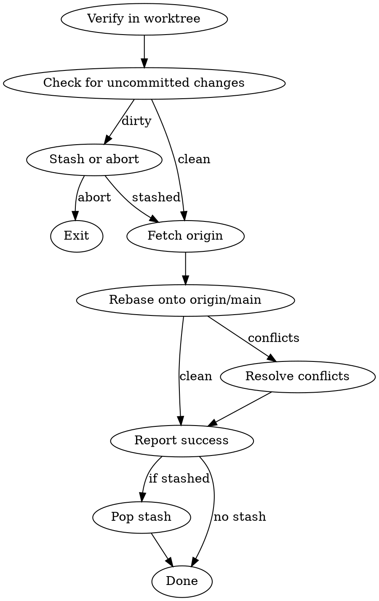

# Sync Worktree with Main

## Overview

Fetches latest main from origin and rebases the current worktree branch onto it. Delegates to `/resolve` if conflicts arise.

## Workflow



## Steps

### 1. Verify Context

```bash
git worktree list
pwd
git branch --show-current
```

Confirm we're in a worktree, not the main repo. If not in a worktree, warn and exit — they can just `git pull` from the main repo.

### 2. Check for Uncommitted Changes

```bash
git status --porcelain
```

If dirty, ask:

```
You have uncommitted changes:
  <list files>

What would you like to do?
1. Stash changes, sync, then restore them
2. Cancel sync (commit first, then sync)
```

If stash: `git stash push -m "worktree:sync auto-stash"`

### 3. Fetch Latest Main

```bash
git fetch origin main
```

Check if there's anything new:

```bash
git log HEAD..origin/main --oneline
```

If no new commits on main, report "Already up to date with main" and exit (pop stash if needed).

### 4. Show What's Coming In

Before rebasing, show what will be incorporated:

```bash
git log HEAD..origin/main --oneline
```

Report: "N new commits on main since you branched. Rebasing..."

### 5. Rebase

```bash
git rebase origin/main
```

**If clean:** Continue to step 6.

**If conflicts:**

Report which files conflict:

```bash
git diff --name-only --diff-filter=U
```

Delegate to `/resolve` for interactive conflict resolution.

After resolution, continue the rebase:

```bash
git rebase --continue
```

Repeat if more conflicts arise in subsequent commits.

### 6. Report Success

```
Rebased <branch> onto latest main.
  - N new commits from main incorporated
  - Your M commits replayed on top
```

### 7. Pop Stash (if stashed)

```bash
git stash pop
```

If stash pop conflicts, warn and let user resolve manually — these are conflicts between their uncommitted changes and the rebased state.

## Edge Cases

- **Not in a worktree:** Exit early, suggest `git pull --rebase origin main` instead
- **No new commits on main:** Report up-to-date, exit early
- **Uncommitted changes:** Stash or cancel — never rebase with a dirty tree
- **Rebase conflicts:** Delegate to `/resolve`, then `git rebase --continue`
- **Stash pop conflicts:** Warn user, don't auto-resolve — these need manual attention
- **Rebase aborted by user:** `git rebase --abort` to restore original state

## Common Mistakes

- **Rebasing with uncommitted changes** — git will refuse or create a mess. Always stash or commit first.
- **Not fetching before rebase** — would rebase onto stale local main, missing remote updates
- **Force-pushing after rebase without asking** — rebase rewrites history. If the branch was already pushed, user needs to `git push --force-with-lease`. The skill should warn about this but NOT auto-force-push.
- **Ignoring stash pop conflicts** — these are a different class of conflict from rebase conflicts

## Post-Sync Note

If the branch was previously pushed to remote, warn:

```
Note: Rebase rewrote your commit history. Your next push will need:
  git push --force-with-lease origin <branch>
```

Do NOT auto-force-push. Let the user decide when to push (via `/worktree-commit` or `/commit`).
